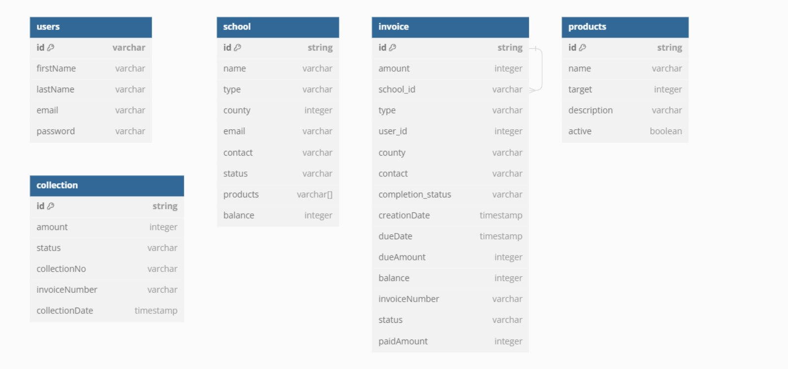
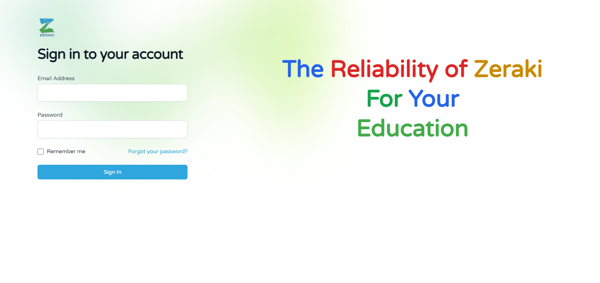
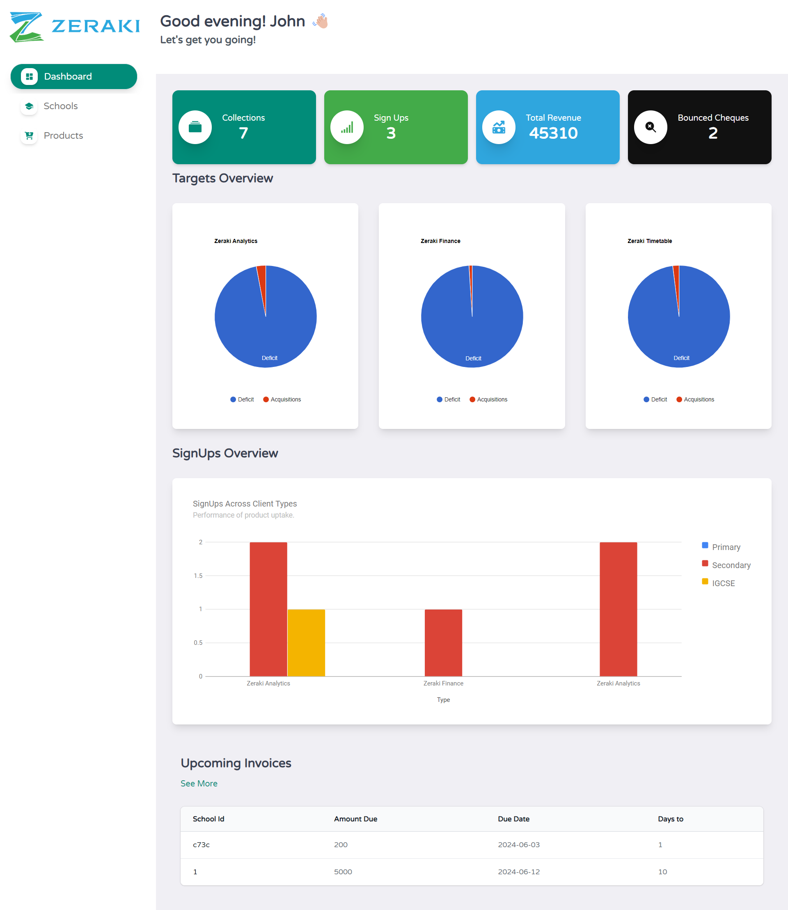

# Sales Dashboard Tracker.

## Table of Contents

1. [Project Description](#description)
2. [Running Locally](#running)
3. [Access Links](#access-links)
4. [Tech Stack](#tech-stack)
5. [Sample Auth Credentials](#sample-auth-credentials)
6. [Resource Mapping](#resource-mapping)
7. [Sample Images](#sample-images)

### Description

- A Sales Agent dashboard that allows users to track product sales by clients(schools). It allows Adding of schools and then linking them with Zeraki Products. Thereafter, users can create invoices based on product usage and create collections based on paymen statuses.
- THe

### Running locally

- In the terminal of a machine with [Git](https://git-scm.com/downloads) and [Node](https://nodejs.org/en) installed, run:

```
git clone https://github.com/vicowiti/client-side.git
```

-This will copy the repository contents to your local machine.
-To install project dependencies, run:

```
cd client-side

npm install
```

-To run the mock server, ensure you are in the project root then run:

```
npx json-server --port 30001 --watch db/db.json
```

-This allows running the mock server without the need to install the [JSON Server](https://www.npmjs.com/package/json-server) locally.

-Finally, in another terminal and while at the project root, run:

```
npm run dev
```

- This opens a local dev server on port 5173. Open a browser window and type in the address "http://localhost:5173"

### Access Links

- Public Github repo: "https://github.com/vicowiti/client-side"
- Live Url: "https://zerakii.netlify.app"
- Deployed server URL: https://json-server-deploy-xut9.onrender.com

### Sample Auth Credentials

- Use the below credentials to authenticate

```
email: "john@example.com",
password: "12345678"
```

### Tech Stack

#### React JS

- Used React for its component based architecture, along with hooks to ensure proper data haandling.

#### Typescript

- To implement a strict type system to minimize bugs and for elegant in code documentation

#### React Router

- For route handling, including utilizing its hooks for navigation parameters and Linking different pages.

#### Tailwindcss with Headless UI

-For modern and elegant styling of the application to give it a consistent look.

### Resource Mapping

- Modelling the resources I worked with



### Sample Images



